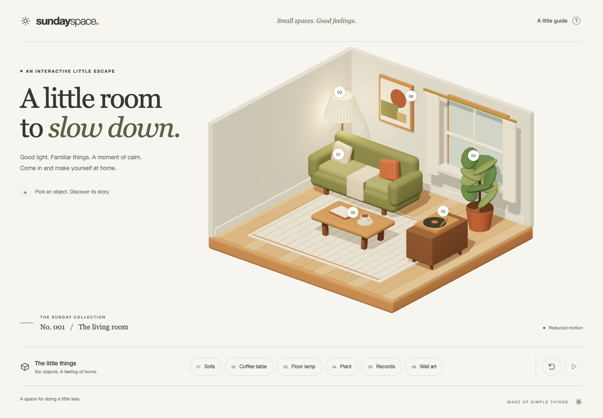

# Sunday Space

A quiet, interactive isometric living room built with React, strict TypeScript, Vite, Three.js, React Three Fiber, and Drei. Every scene object is modeled in code; no downloaded models, images, textures, fonts, or audio are used.



## Experience

Six explorable objects, soft shadows, warm materials, numbered markers, interruptible camera focus, gentle leaf movement and coffee steam. Responsive HTML controls provide the same stories without WebGL. System reduced motion, ambient pause, keyboard focus, Escape, and context-loss recovery are supported. The record player is decorative; there is no audio.

## Setup

Use Node.js 22 and npm.

```sh
npm ci
npm run dev
```

Open the local URL printed by Vite, including `/sunday-space/`.

## Controls

- Click or tap an object, numbered marker, or object-list button to focus it.
- Tab through HTML controls; Enter or Space activates them.
- Escape, “Back to the room,” the close button, or the reset icon restores the full view.
- Pause/resume controls ambient animation. System reduced motion also makes camera transitions immediate.
- “A little guide” explains controls. The camera uses composed views, without free orbit or zoom gestures; browser zoom remains available.

## Commands

| Command                | Purpose                                                  |
| ---------------------- | -------------------------------------------------------- |
| `npm run dev`          | Development server                                       |
| `npm run build`        | Type checking and production bundle                      |
| `npm run preview`      | Serve the production bundle                              |
| `npm run format`       | Format source and documentation                          |
| `npm run format:check` | Check formatting                                         |
| `npm run lint`         | TypeScript, Hooks, unused code, import placement         |
| `npm run typecheck`    | Strict application, configuration, and test checking     |
| `npm test`             | Unit behavior tests                                      |
| `npm run test:e2e`     | Desktop and mobile Chromium browser tests against `dist` |
| `npm run check`        | Formatting, lint, types, unit tests, production build    |

Before browser tests: `npm run build && npx playwright install chromium`. Browser tests are a separate required CI step after `check`. They run one worker with reduced motion by default. Software WebGL is forced only in CI; avoid running simultaneous WebGL test or screenshot sessions locally.

## Architecture

- `src/App.tsx`: page composition and panel focus ownership.
- `src/components`: reusable icons, error boundary, accessible fallback.
- `src/config/objects.ts`: typed IDs, metadata, marker positions, camera targets.
- `src/state`: pure selection reducer and system motion preference subscription.
- `src/lib/motion.ts`: rendering-independent, bounded exponential transition calculations.
- `src/scene`: room geometry, primitives, palette, lighting, camera, Canvas lifecycle.
- `src/styles.css`: shared semantic tokens, controls, responsive layout.

Frame values live in refs or Three.js objects. Frame deltas are capped at 1/30 second so background pauses do not cause jumps. The camera approaches new targets from its current position. R3F owns and disposes declarative resources on unmount. Event subscriptions are cleaned up. Resolution is capped at 1.5 DPR; one cached 1024px shadow map is used. Floorboards share instanced geometry and material. Paused and reduced-motion views render on demand and stop requesting frames once the camera settles. Leaf shadows remain static. No frame-rate target is claimed. The Three.js bundle is lazy-loaded; it is still a substantial initial download for the 3D view.

## GitHub Pages

The repository's detected production branch is `main`. `.github/workflows/pages.yml` checks pull requests and pushes to `main`; successful production checks deploy the same tested `dist` artifact. Manual deployment: Actions → Verify and deploy → Run workflow → `main`.

1. In Settings → Pages, select **GitHub Actions** as the build source.
2. Allow the `github-pages` environment to deploy from `main`; configure any required reviewers to your preference.
3. Ensure repository Actions are enabled and pinned official actions are allowed.
4. Set branch protection to require the `verify` job before merging.

Vite uses `/sunday-space/`, matching the expected URL `https://hostlife22.github.io/sunday-space/`. Change `base`, the Playwright base URL, and web-server URL together if the repository is renamed or uses a custom domain. No secrets or environment variables are needed. Deployment has not been performed or verified from this workspace.

References: [Vite Pages deployment](https://vite.dev/guide/static-deploy.html#github-pages), [GitHub custom Pages workflows](https://docs.github.com/en/pages/getting-started-with-github-pages/using-custom-workflows-with-github-pages).

## Verification status

`npm run check` passes, including five unit tests and the production build. A clean `npm ci` was verified and the dependency audit reported no known vulnerabilities. Desktop and mobile screenshots were reviewed. Eight browser cases passed in the final browser run before it was stopped due to high CPU use from concurrent software WebGL; the other two cases passed in an earlier run. The subsequent on-demand rendering and lower shadow-budget changes passed static checks and build, but have not been browser-verified locally. CI requires the complete ten-case browser suite. The lazy scene chunk is approximately 245 kB gzip; real-device performance, Safari, Firefox, and screen readers remain unverified.

## Repository metadata

Suggested description: **A cozy, code-crafted 3D room with accessible interactions, built with React Three Fiber and TypeScript.**

Suggested topics: `react`, `typescript`, `threejs`, `react-three-fiber`, `vite`, `webgl`, `isometric`, `accessibility`, `github-pages`.

See [accessibility notes](ACCESSIBILITY.md), [contribution guidelines](CONTRIBUTING.md), and [security reporting](SECURITY.md). MIT © 2026 Hostlife22.
